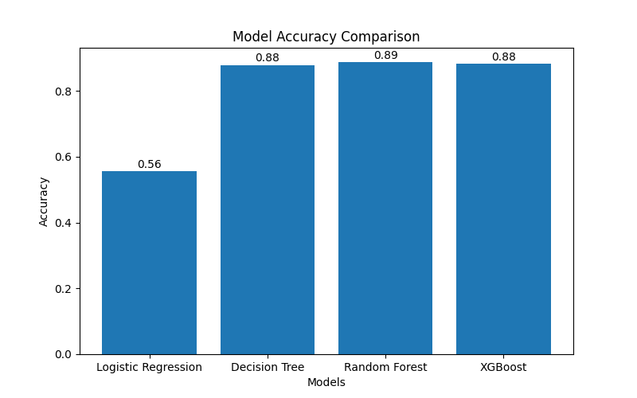
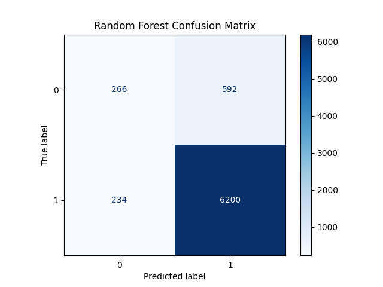

# 💳 Credit Card Approval Prediction using Machine Learning

A Machine Learning-based web application that predicts whether a customer's credit card application will be **Approved** or **Rejected** based on demographic and financial information.

The project compares multiple Machine Learning algorithms and deploys the best-performing model using **Flask**.

---

## 📖 Project Overview

Banks receive thousands of credit card applications every day. Manually reviewing each application is time-consuming and prone to human error.

This project automates the approval process using Machine Learning. After preprocessing the applicant data, multiple classification algorithms are trained and compared. The best-performing model is integrated into a Flask web application for real-time prediction.

---

## 🎯 Objectives

- Automate credit card approval prediction.
- Reduce manual verification time.
- Compare multiple Machine Learning models.
- Deploy the best model using Flask.
- Provide real-time predictions through a user-friendly web interface.

---

## 🛠️ Technologies Used

### Programming Language
- Python

### Machine Learning
- Scikit-learn
- XGBoost

### Data Processing
- Pandas
- NumPy

### Data Visualization
- Matplotlib

### Web Framework
- Flask

### Frontend
- HTML5
- CSS3

### Model Storage
- Joblib

---

## 📂 Dataset

The project uses two datasets:

- application_record.csv
- credit_record.csv

These datasets contain customer demographic and financial information used for training the prediction model.

---

## 📊 Features Used

The prediction model uses the following features:

- Gender
- Own Car
- Own House
- Number of Children
- Annual Income
- Income Type
- Education
- Family Status
- Housing Type
- Days Birth
- Days Employed
- Mobile
- Work Phone
- Phone
- Email
- Occupation Type
- Family Members

---

## 🔄 Project Workflow

```
Data Collection
        │
        ▼
Data Preprocessing
        │
        ▼
Missing Value Handling
        │
        ▼
Label Encoding
        │
        ▼
Feature Scaling
        │
        ▼
Train-Test Split
        │
        ▼
Model Training
(Logistic Regression,
Decision Tree,
Random Forest,
XGBoost)
        │
        ▼
Model Evaluation
        │
        ▼
Best Model Selection
        │
        ▼
Model Saving
        │
        ▼
Flask Deployment
        │
        ▼
Real-Time Prediction
```

---

## 🤖 Machine Learning Models

The following Machine Learning algorithms were implemented and compared:

- Logistic Regression
- Decision Tree
- Random Forest
- XGBoost

---

## 📈 Model Performance

| Model | Accuracy |
|--------|----------|
| Logistic Regression | **55.68%** |
| Decision Tree | **87.88%** |
| Random Forest | **88.67%** ⭐ Best Model |
| XGBoost | **88.34%** |

Random Forest achieved the highest accuracy and was selected as the final prediction model.

---

## 📊 Model Evaluation

### Accuracy Comparison



---

### Confusion Matrix



---

## 🌐 Flask Web Application

The Flask application allows users to:

- Enter applicant details
- Predict Credit Card Approval
- View Approval or Rejection status
- Display prediction confidence

---

## 📁 Project Structure

```
Credit-Card-Approval-Prediction/
│
├── dataset/
│   ├── application_record.csv
│   └── credit_record.csv
│
├── model/
│   ├── credit_model.pkl
│   ├── scaler.pkl
│   └── encoders.pkl
│
├── static/
│   └── style.css
│
├── templates/
│   └── index.html
│
├── app.py
├── train.py
├── requirements.txt
├── README.md
├── accuracy_graph.png
├── confusion_matrix.png
└── .gitignore
```

---

## 🚀 Installation

### Clone Repository

```bash
git clone https://github.com/HymavathiSaidu/Credit-Card-Approval-Prediction-ML.git
```

### Navigate to Project

```bash
cd Credit-Card-Approval-Prediction-ML
```

### Install Dependencies

```bash
pip install -r requirements.txt
```

### Train Model

```bash
python train.py
```

### Run Flask Application

```bash
python app.py
```

### Open Browser

```
http://127.0.0.1:5000
```

---

## 📷 Application Features

- User-friendly interface
- Real-time prediction
- Confidence score display
- Multiple ML model comparison
- Data preprocessing pipeline
- Model persistence using Joblib

---

## 🔮 Future Enhancements

- User Authentication
- Database Integration
- REST API
- Cloud Deployment (AWS/Azure)
- Explainable AI (SHAP)
- Deep Learning Models
- Mobile Application

---
## 📸 Application Screenshots

### Home Page


---

### Prediction Result


---

### Accuracy Comparison


---

### Confusion Matrix


## 👨‍💻 Author

**Hymavathi**

Bachelor of Technology (Information Technology)

GitHub: https://github.com/HymavathiSaidu

LinkedIn: *(Add your LinkedIn profile link here)*

---

## 📄 License

This project is developed for educational and academic purposes.

---

## ⭐ Support

If you found this project useful, please ⭐ this repository on GitHub.
